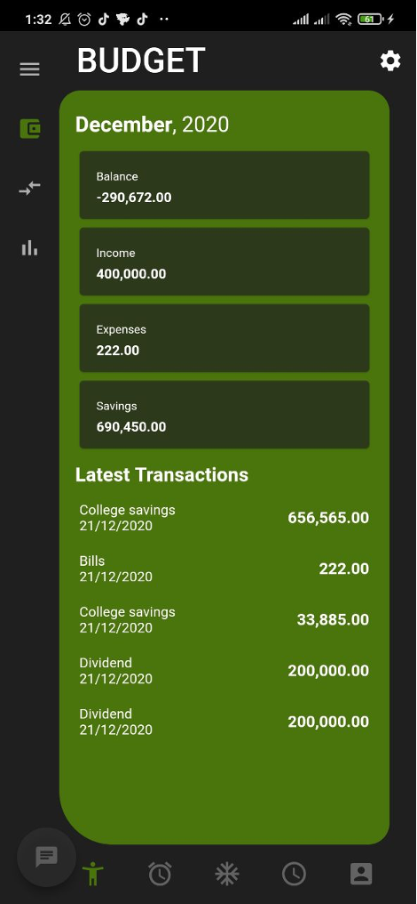
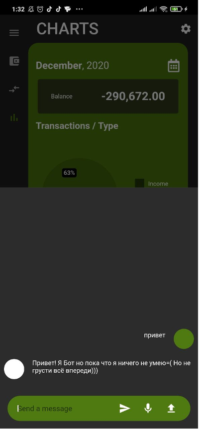

# FinaMoon

Finance manager on Linux + Android + Ios

## Technologies
Flutter
DialogFlow
Sqlite
SharedPreferenses
Bloc + Provider

# Description
Для начала необходимо установить приложение на мобильный устройство. Запустим наше приложение. Сразу после запуска мы увидим окно ввода пароля
 

 
Также присутствует авторизация с помощью отпечатка пальца. Если успешно пройти авторизацию на первой странице, то произойдет переход на главную страницу где        можно просмотреть списки расходов, доходов и сбережени
 

 
При смахивании вниз происходит переход на страницу создания транзакции, где пользователь может ввести такие данные как: название дохода или расхода, сумма, выбрать категорию. Также запланировать транзакцию, и определить срок её действия
 

 
После ввода данных и нажатии кнопки «создать» произойдет создание события и переход на главный экран приложения. При смахивании вправо происходит переход на страницу создания просмотра проведенных транзакций по месяцам , где пользователь может выбрать нужную ему транзакцию из списка и открыть страницу выбора операции над транзакцией.
 

 
Если выбрать пункт удаления транзакции, то откроется диалоговое окно для подтверждения , если же пункт изменения, то откроется окно редактирования транзакции
 

 
Если заполнить приложение данными то в окне графиков появляются графики транзакций
 

 
	Если в меню выбрать пункт «Валюта» то откроется окно конвертации валют, приложение получает актуальные курсы из открытой АПИ и сохраняет в локальную базу данных из-за чего даже при неработающем интернете можно будет получит приблизительные значениея
 

 
Если обобщить все вышесказанное и показанное, то на данных скриншотах приведена работа приложение и с помощью текста изложены все нюансы при работе с ним.
При нажатии на кнопку в левой нижней части экрана открывается переписка с ботом на Dialogflow, на данный момент он не сильно обучен но в перспективе все описанные ранее операции можно будет проводить через него
 

 
